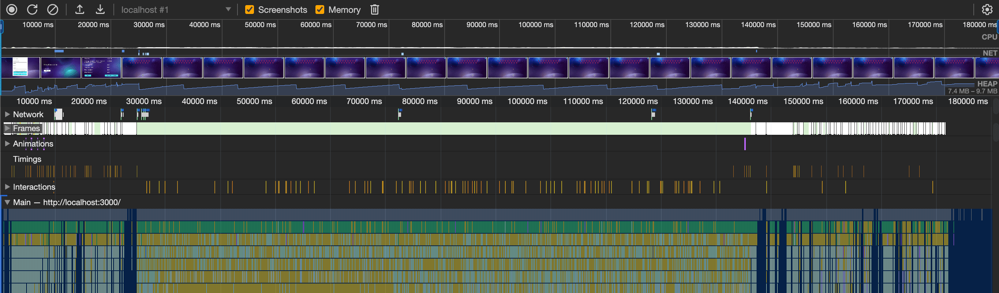
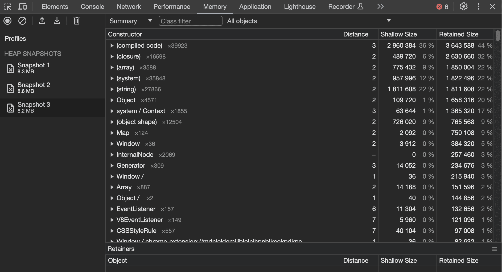

# Анализ утечек памяти

## Инструменты:

Для проведения анализа приложения на предмет утечек памяти были найдены и проанализированы следующие инструменты:
- **Chrome Devtools:**
  - Performance
  - Memory

Chrome Devtools отличный комплексный инструмент для отслеживания наполнения JS Heap, создания снапшотов затрат памяти и анализа её утечек.

## Анализ:

1) Первым делом необходимо было понять, как наполняется **JS Heap** в процессе использования приложения.
Для этого был проведен замер с помощью вкладки `Chrome Devtools: Performance` в инструментах разработчика.

Запись длилась 3 минуты, ее результаты вы можете увидеть на скриншоте ниже:

Как можно увидеть из записи, размер JS Heap варьируется от 7.4 до 9.7 мб.

По графику видно, что механизм "Сборщика мусора" отрабатывает и скачками память периодически возвращается к исходным значениям. Пока что информации недостаточно, чтобы судить об утечках

2) Следующим шагом стало сравнение скриншотов "кучи" во вкладке `Memory`.

Страницы были протестированы следующим образом:
  - Находимся в главном меню --> делаем снапшот
  - Переходим на целевую страницу и взаимодействуем с интерфейсом --> делаем снапшот
  - Возвращаемся на главную страницу --> делаем снапшот

Пример со страницей Profile: 

Как видно из скриншота, после манипуляций с интерфейсом, размер JS Heap не изменился. Отсюда можно сделать вывод, что утечек на странице нет.
Во время манипуляций память JS кучи немного возросла, но это ожидаемое поведение.

Подобным образом были проанализированы следующие страницы: `Profile`, `Forum`, `Topic`, `Play`, `Highscore`, `GameOver`;

Анализ показал, что критичных утечек памяти в проекте нет. Основные затраты памяти связаны с работой библиотек, установленных в проекте.

## Исправленные ошибки:

1. На странице Main был очищен setTimeout после размонтирования компонента (тестовый функционал, исправлять было не обязательно).
2. В игровом движке очищаются обработчики событий после завершения игрового процесса
